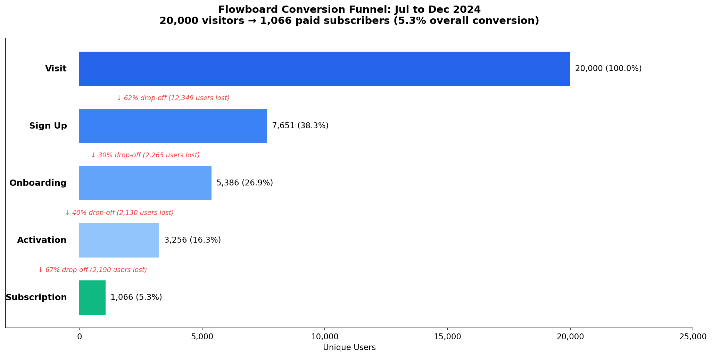
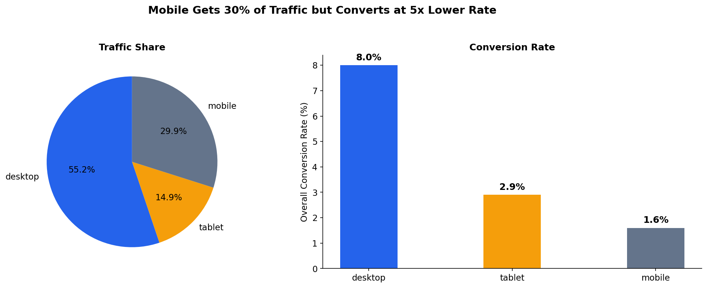
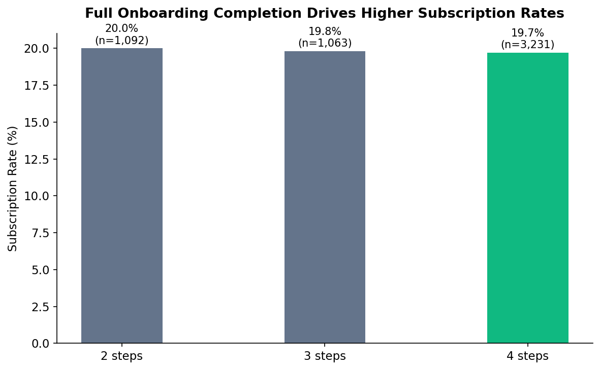

# SaaS Funnel Analysis
End-to-end SaaS funnel analysis using SQL and Python.

## Executive Summary  
This project analyzes user behavior across a SaaS conversion funnel to identify where users drop off and how to improve conversion.  

The analysis shows that the largest loss occurs at the top of the funnel (visit → sign-up) and that mobile users significantly underperform desktop users. Although activated users show strong intent, many do not convert to paid.  

The main opportunities are reducing signup friction, improving the mobile experience, and strengthening the transition from activation to subscription.

Even small improvements at the top of the funnel would have the largest impact on overall conversions.

---

## Business Problem  
The company is experiencing low conversion from visitors to paying customers.  

The key questions are:
- Where do users drop off in the funnel?  
- Which segments perform best or worst?  
- What changes would most effectively increase conversions and revenue?

---

## Note  

This project uses a synthetic dataset designed to simulate realistic SaaS user behavior.  
The analysis focuses on methodology and decision-making rather than real production data.

---

## How to Use This Project  

1. Start with `notebooks/02_findings_and_recs.ipynb` for the final insights and business recommendations  
2. Refer to `notebooks/01_analysis.ipynb` for the full data cleaning and exploratory analysis workflow  
3. Charts used in this project are available in the `graphs/` folder  

---

## Methodology  

**Funnel Analysis**  
- Measured user counts across key stages (visit → sign-up → activation → subscription)  
- Calculated step-to-step conversion rates  
- Identified major drop-off points  

**Segmentation**  
- Analyzed performance by channel, device, and company size  
- Compared conversion rates across segments  

**Behavioral Analysis**  
- Measured time between funnel stages  
- Evaluated onboarding completion vs conversion  
- Analyzed engagement patterns by stage  

**Visualization**  
- Built funnel charts and time-based trends  
- Created segment comparison plots

👉 View the dashboard here: 
(https://public.tableau.com/views/SaaSFunnelAnalysis-ConversionBottlenecksGrowthOpportunities/Dashboard1?:language=en-US&publish=yes&:sid=&:redirect=auth&:display_count=n&:origin=viz_share_link)

---

## Skills  

- SQL (data extraction and aggregation)  
- Python (pandas, matplotlib)  
- Data cleaning and transformation  
- Funnel analysis  
- Exploratory data analysis  
- Data visualization  
- Translating data into business insights

---

## Requirements
pandas
numpy
matplotlib
sqlite3

---

## Results and Business Recommendations  

**1. High drop-off at visit → sign-up**  
Most users leave before creating an account.  
→ Reduce form complexity, test social login, and optimize landing pages  

**2. Mobile users convert significantly worse**  
Mobile conversion rates are consistently lower than desktop.  
→ Improve mobile UX, simplify flows, and address performance issues  

**3. Activation → subscription is a bottleneck**  
Users who activate do not consistently convert to paid.  
→ Add upgrade prompts, improve feature visibility, and use lifecycle messaging  

**4. Referral channel shows the highest conversion**  
Referral users convert better than other channels.  
→ Invest in referral programs and scale high-performing sources  

**5. Onboarding completion strongly correlates with conversion**  
Users who complete onboarding are more likely to convert.  
→ Identify drop-off steps and streamline onboarding  

---

## Next Steps  

- Build a cohort-based funnel to track users sequentially over time  
- Identify specific friction points within signup and onboarding flows  
- Run A/B tests on signup, onboarding, and pricing strategies  
- Analyze retention and churn after subscription  
- Incorporate additional data sources such as product usage or marketing campaigns  

---

## Results Preview  

### Funnel Overview  

### Device Performance  

### Onboarding Impact  

